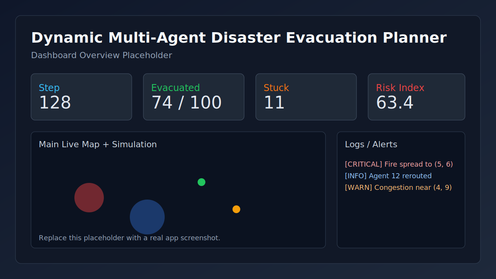
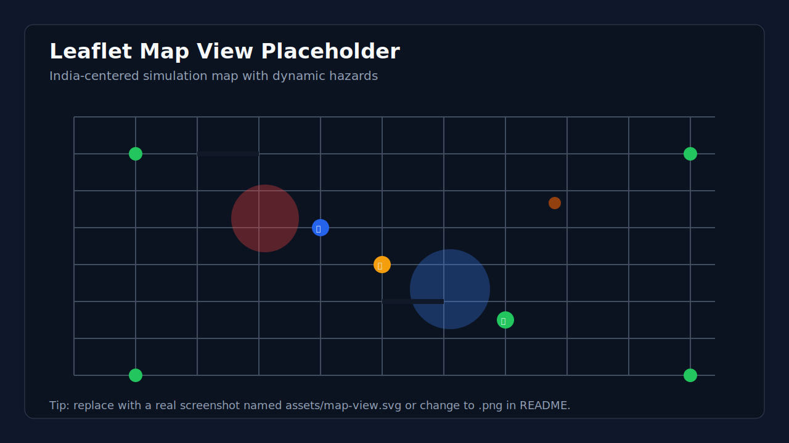
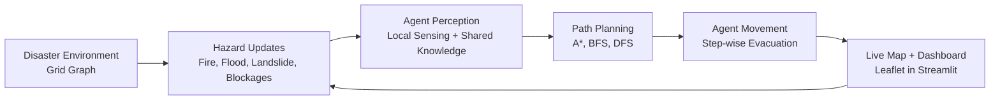
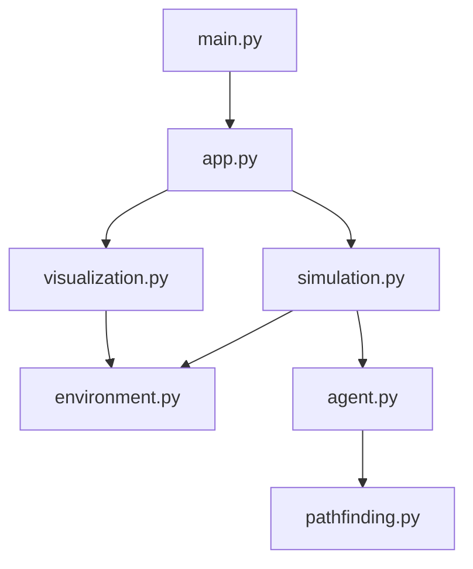

# Dynamic Multi-Agent Disaster Evacuation Planner

A full Python + Streamlit application that simulates multi-agent disaster evacuation .
## Features

- Multi-agent evacuation simulation with real-time map updates.
- Disaster dynamics with probability-based:
  - fire spread
  - blocked nodes
  - blocked roads
- Agent decision logic:
  - avoid nearby fire
  - avoid blocked paths
  - avoid high congestion
  - replan routes dynamically
  - share hazard knowledge with other agents
- Pathfinding algorithms:
  - BFS
  - DFS
  - A* (default)
- Interactive Streamlit dashboard controls:
  - Start simulation
  - Pause simulation
  - Run one step
  - Reset simulation
  - Apply scenario presets (including Fire Prone India, Flood Prone India)
  - Auto-start after applying preset
  - Add fire location
  - Add blocked road
  - Set number of agents
- Visualization with Leaflet (via Folium + streamlit-folium):
  - roads
  - danger zones
  - evacuation exits
  - moving agents
  - blocked roads and congestion heatmap

## Project Structure

- `app.py` - main Streamlit app
- `main.py` - one-file launcher that runs the full app
- `environment.py` - disaster environment graph and probabilistic updates
- `agent.py` - multi-agent perception, communication, and decision behavior
- `pathfinding.py` - BFS, DFS, and A* implementations
- `simulation.py` - simulation engine and step logic
- `visualization.py` - Leaflet/Folium map rendering

## Installation

```bash
python -m venv .venv
source .venv/bin/activate
pip install -r requirements.txt
```

## Run

Run everything through one file:

```bash
python main.py
```

Optional (custom host/port and headless mode):

```bash
python main.py --host 0.0.0.0 --port 8501 --headless
```

Direct Streamlit run (alternative):

```bash
streamlit run app.py
```

Then open the local URL shown in the terminal (usually `http://localhost:8501`).

## Visualization Preview

Add screenshots to an `assets/` folder and they will render automatically in this README.




### Map Legend

| Visual Element | Meaning |
| --- | --- |
| Gray road lines | Traversable roads |
| Black road lines | Blocked roads |
| Green markers | Safe exits |
| Red circles | Fire zones |
| Blue circles | Flood zones |
| Brown markers | Landslide zones |
| Bike markers | Civilian agents (moving/stuck/evacuated by color) |
| Orange glow circles | Congestion hotspots |

### System Flow (High Level)



### Module Architecture



## How it Works

1. The city is represented as a grid graph where:
   - nodes = intersections/locations
   - edges = roads
2. Agents spawn at random safe nodes and target nearest exits.
3. At each simulation step:
   - hazards evolve probabilistically
   - agents perceive local hazards
   - agents share hazard information
   - agents replan paths if hazards or congestion affect routes
   - agents move one node toward exits
4. Agent statuses update (`moving`, `stuck`, `evacuated`) and logs/metrics are refreshed.

## Notes

- A* uses Manhattan heuristic on the grid.
- BFS and DFS are available for comparison.
- The congestion heatmap is optional and can be toggled from the UI.
